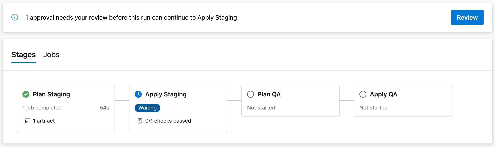

# Terraform starter project for Azure Pipelines

<!-- 
Guidelines on README format: https://review.docs.microsoft.com/help/onboard/admin/samples/concepts/readme-template?branch=master

Guidance on onboarding samples to docs.microsoft.com/samples: https://review.docs.microsoft.com/help/onboard/admin/samples/process/onboarding?branch=master

Taxonomies for products and languages: https://review.docs.microsoft.com/new-hope/information-architecture/metadata/taxonomies?branch=master
-->

This project can be used as a starter for Azure Pipelines deploying resources on Terraform.


## Contents

| File/folder             | Description                                                  |
|-------------------------|--------------------------------------------------------------|
| `infrastructure`        | YAML pipeline templates shared across the samples.           |
| `101-terraform-job`     | Sample YAML pipeline for a simple Terraform job.             |
| `201-plan-apply-stages` | Sample YAML pipeline for manually approving plans.           |
| `301-deploy-agent-vms`  | Sample YAML pipeline for deploying build agent VMs.          |
| `docs`                  | Resources related to documentation.                          |
| `CODE_OF_CONDUCT.md`    | Microsoft Open Source Code of Conduct.                       |
| `LICENSE`               | The license for the sample.                                  |
| `README.md`             | This README file.                                            |
| `SECURITY.md`           | Reporting security issues.                                   |

# Templates

## 101 Basic Terraform job

The first template shows how to build an environment from Terraform configuration, and run
a subsequent job configured from Terraform outputs.

[101-terraform-job: Basic Terraform job](101-terraform-job)


## 201 Separate Plan and Apply stages

The next template shows how to build a multi-stage pipeline
allowing to manually review and approve infrastructure changes before they are deployed.

[201-plan-apply-stages: Separate Plan and Apply stages](201-plan-apply-stages)



## 301 Deploy hosted agent VMs

The next template shows how to use Terraform to deploy a pool of agent VMs on which to run
subsequent jobs.

[301-deploy-agent-vms: Deploy hosted agent VMs](301-deploy-agent-vms)


# How to use the templates

## Variables and state management

Variables can be injected using `TF_VAR_` syntax in the `TerraformEnvVariables` parameter or the
`-var key=value` syntax in the `TerraformArguments` parameter.
The pipelines demonstrates this by adding a custom tag named `department` to the
created resource group, with distinct values in staging and QA.

Rather than passing a Terraform plan between stages (which would contain clear-text secrets),
the pipeline in the
[201-plan-apply-stages](201-plan-apply-stages) sample
performs `terraform plan` again before applying changes and verifies that
a textual representation of the plan (not including secrets values) is unchanged.

The Terraform state is managed in a Azure Storage backend. Note that this backend contains
secrets in cleartext.

## Secrets management

### Generate secrets with Terraform

To demonstrate one approach to secrets management, the Terraform configuration
generates a random password (per stage) for the SQL Server 1 instance, stored in
Terraform state.
You can adapt this to suit your lifecycle.

### Manage secrets with Azure DevOps

You might want to read credentials from an externally managed Key Vault
or inject them via pipeline variables. This approach is demonstrated
by defining a password for the SQL Server 2 instance and passing
it to Terraform via an environment variable.

## Getting started

In `infrastructure/terraform/variables.tf`, change the `appname` default value from
`starterterraform` to a globally unique name.

## Azure DevOps pipeline

Install the [Terraform extension for Azure DevOps](https://marketplace.visualstudio.com/items?itemName=ms-devlabs.custom-terraform-tasks).

Create a Service Connection of type Azure Resource Manager at subscription scope. Name the Service Connection `Terraform`.
Allow all pipelines to use the connection.

In `infrastructure/terraform-init-template.yml`, update the `TerraformBackendStorageAccount` name to a globally unique storage account name.
The pipeline will create the storage account.

Create a build pipeline referencing `101-terraform-job/azure-pipelines.yml`.

## Usage on non-master branch

To avoid issues with concurrent access to the Terraform state file, the jobs running Terraform `plan` and `apply` commands
run by default only on the `master` branch. On other branches, they are skipped by default:


You can set the `RUN_FLAG_TERRAFORM` variable (to any non-empty value)
when running the pipeline, to trigger Terraform application on a non-`master` branch.

## Local development

In local development, no backend is configured so a local backend is used.

Install Azure CLI and login. Terraform will use your Azure CLI credentials.

```
$ az login -o table
You have logged in. Now let us find all the subscriptions to which you have access...
CloudName    IsDefault    Name                                                  State    TenantId
-----------  -----------  ----------------------------------------------------  -------  ------------------------------------
AzureCloud   True         My Azure subscription                                 Enabled  xxxxxxxx-xxxx-xxxx-xxxx-xxxxxxxxxxxx
AzureCloud   False        My other Azure subscription                           Enabled  xxxxxxxx-xxxx-xxxx-xxxx-xxxxxxxxxxxx
```

Run `terraform init`.

```
$ terraform init

Initializing the backend...

Initializing provider plugins...
- Checking for available provider plugins...
- Downloading plugin for provider "azurerm" (hashicorp/azurerm) 1.38.0...

Terraform has been successfully initialized!

You may now begin working with Terraform. Try running "terraform plan" to see
any changes that are required for your infrastructure. All Terraform commands
should now work.

If you ever set or change modules or backend configuration for Terraform,
rerun this command to reinitialize your working directory. If you forget, other
commands will detect it and remind you to do so if necessary.
```

Run `terraform plan`.

```
$ terraform plan -out tfplan
Refreshing Terraform state in-memory prior to plan...
The refreshed state will be used to calculate this plan, but will not be
persisted to local or remote state storage.

data.azurerm_client_config.current: Refreshing state...

------------------------------------------------------------------------

An execution plan has been generated and is shown below.
Resource actions are indicated with the following symbols:
  + create

Terraform will perform the following actions:

  # azurerm_resource_group.main will be created
  + resource "azurerm_resource_group" "main" {
      + id       = (known after apply)
      + location = "northeurope"
      + name     = "rg-starterterraform-dev-main"
      + tags     = (known after apply)
    }

Plan: 1 to add, 0 to change, 0 to destroy.
```

Run `terraform apply tfplan`.

```
$ terraform apply tfplan
data.azurerm_client_config.current: Refreshing state...

An execution plan has been generated and is shown below.
Resource actions are indicated with the following symbols:
  + create

Terraform will perform the following actions:

  # azurerm_resource_group.main will be created
  + resource "azurerm_resource_group" "main" {
      + id       = (known after apply)
      + location = "northeurope"
      + name     = "rg-starterterraform-dev-main"
      + tags     = (known after apply)
    }

Plan: 1 to add, 0 to change, 0 to destroy.

Do you want to perform these actions?
  Terraform will perform the actions described above.
  Only 'yes' will be accepted to approve.

  Enter a value: yes

azurerm_resource_group.main: Creating...
azurerm_resource_group.main: Creation complete after 1s [id=/subscriptions/xxxxxxxx-xxxx-xxxx-xxxx-xxxxxxxxxxxx/resourceGroups/rg-starterterraform-dev-main]

Apply complete! Resources: 1 added, 0 changed, 0 destroyed.

Outputs:

subscription_id = xxxxxxxx-xxxx-xxxx-xxxx-xxxxxxxxxxxx
```

At this stage you will have a new resource group deployed named `rg-starterterraform-dev-main`. 

# Using Terraform outputs

The pipeline automatically exports Terraform outputs into pipeline variables.

The pipelines contain a sample job that consumes those variables:


- For example, in the template [301-deploy-agent-vms](301-deploy-agent-vms), the Terraform config has an output named [agent_vm_ids](301-deploy-agent-vms/terraform/outputs.tf). In the subsequent task used
we use the bash variable [AGENT_VM_IDS](301-deploy-agent-vms/terraform-stages-template.yml) to pass the list of agent VMs to the `az start` command.

This mechanism is useful for using generated resource names, access keys,
and even [entire kube_config files](https://www.terraform.io/docs/providers/azurerm/r/kubernetes_cluster.html#kube_config_raw) (for Azure Kubernetes Service)
in downstream testing or continuous delivery jobs.

# Next steps

* You can of course adapt the pipeline to other environments, such as Production.

## Contributing

This project welcomes contributions and suggestions.  Most contributions require you to agree to a
Contributor License Agreement (CLA) declaring that you have the right to, and actually do, grant us
the rights to use your contribution. For details, visit https://cla.opensource.microsoft.com.

When you submit a pull request, a CLA bot will automatically determine whether you need to provide
a CLA and decorate the PR appropriately (e.g., status check, comment). Simply follow the instructions
provided by the bot. You will only need to do this once across all repos using our CLA.

This project has adopted the [Microsoft Open Source Code of Conduct](https://opensource.microsoft.com/codeofconduct/).
For more information see the [Code of Conduct FAQ](https://opensource.microsoft.com/codeofconduct/faq/) or
contact [opencode@microsoft.com](mailto:opencode@microsoft.com) with any additional questions or comments.
